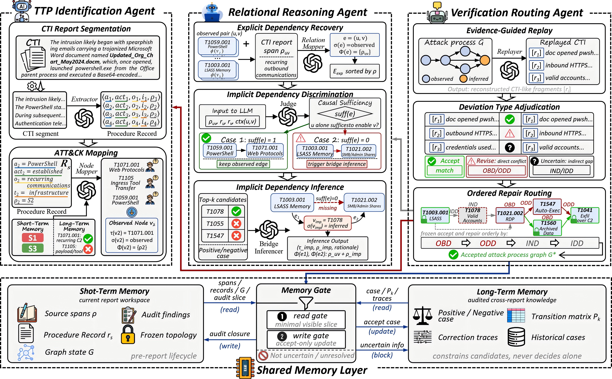
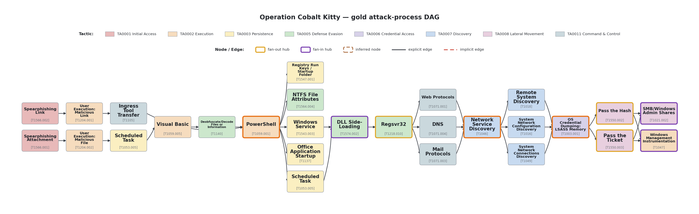
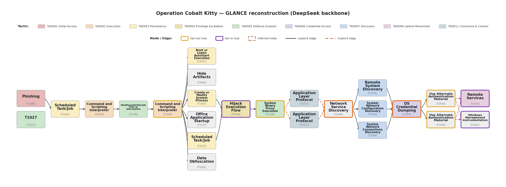

<div align="center">

# GLANCE

### Operationalizing Cyber Threat Intelligence: Evidence-Grounded Attack Process Reconstruction with Multi-Agent LLMs

*An evidence-driven multi-agent framework that reconstructs the attack process inside a CTI report into a machine-actionable ATT&CK attack-process graph.*


## Overview

Cyber threat intelligence (CTI) reports describe the adversary behavior of real-world intrusions for human analysts. Large language models (LLMs) can, in principle, turn this analyst-facing text into a **machine-actionable attack process** that downstream risk assessment consumes. But a report states its attack steps *ambiguously*, leaves the dependencies between them *implicit*, and feeds each early error forward as context — so a naively reconstructed graph drifts away from what the report actually describes.

We formulate the **CTI-to-Attack-Process** task — the first to turn an analyst-facing report into a machine-actionable attack process — and propose **GLANCE**, an evidence-driven multi-agent framework that organizes three agents over a shared memory foundation:

- **① Identification Agent** — parses each attack step into an evidence-anchored *procedure record* and maps it to an ATT&CK technique, resolving the **node-level ambiguity**.
- **② Relational Reasoning Agent** — recovers **path-level implicit dependencies** by coupling an evidence-driven causal-sufficiency judgment with cross-report long-term memory.
- **③ Verification Routing Agent** — contains the **graph-level error cascade** by replaying the graph against the report and repairing each deviation in place while freezing the rest, under memory guidance.

A **shared memory layer** (per-report short-term memory + audited cross-report long-term memory, mediated by a *Memory Gate*) supplies soft priors that constrain candidates but never decide alone.



## Requirements

- **Python ≥ 3.9** (a virtual environment is recommended)
- `openai >= 1.0` — OpenAI-compatible chat client (Qwen / DeepSeek / OpenAI / …)
- `socksio >= 1.0` — SOCKS support when tunneling to the provider
- `PyYAML >= 6.0` — config loading
- `matplotlib >= 3.5` — graph visualization (`tools/render_graph.py`) only
- Tested on macOS / Linux.

```bash
python3 -m venv .venv
.venv/bin/pip install -r requirements.txt
```

GLANCE is **backbone-agnostic** — it runs on any OpenAI-compatible chat API at temperature 0. The paper's default backbone is **Qwen3.6-27B**, and the end-to-end / cost studies also instantiate GLANCE on lighter backbones (3B–27B). The configuration shipped here defaults to a **DeepSeek** backbone (the case study below was produced on DeepSeek); switch backbone by editing `.env`. Provide a key through a git-ignored `.env` — **never commit a real key**:

```bash
cp .env.example .env      # then set EDL_API_KEY (and EDL_BASE_URL / EDL_MODEL)
```

## Datasets

GLANCE is evaluated on **7 open-source CTI datasets**. Identification datasets are sentence-level; the graph datasets pair each report with a gold attack-process graph and are evaluation-only. The `+` suffix marks our standardized graph conversion of a source corpus.

| Task | Dataset | #Train / #Test | Source |
|---|---|---|---|
| Technique identification | **TTPHunter** | 6,716 / 1,671 | [github.com/nanda-rani/TTPHunter…](https://github.com/nanda-rani/TTPHunter-Automated-Extraction-of-Actionable-Intelligence-as-TTPs-from-Narrative-Threat-Reports) |
| | **TTPXHunter** | 38,246 / 9,614 | [github.com/nanda-rani/TTPXHunter…](https://github.com/nanda-rani/TTPXHunter-Actionable-Threat-Intelligence-Extraction-as-TTPs-from-Finished-Cyber-Threat-Reports) |
| | **TTPFShot-DSA** | 15,817 / 3,930 | [paper (ARES'25)](https://link.springer.com/chapter/10.1007/978-3-032-00627-1_19) |
| | **TRAM** | 4,087 / 1,023 | [github.com/center-for-threat-informed-defense/tram](https://github.com/center-for-threat-informed-defense/tram) |
| | **Adema** (Adema-1/2/X) | 14,046 / 3,512 | [github.com/das-lab/Adema](https://github.com/das-lab/Adema) |
| Relational reasoning / end-to-end | **AttackFlow+** | 35 (eval-only) | [MITRE Attack Flow](https://github.com/center-for-threat-informed-defense/attack-flow) |
| | **ChronoCTI+** | 51 (eval-only) | [ChronoCTI paper (arXiv:2401.01883)](https://arxiv.org/abs/2401.01883) |

> Adema is partitioned into **Adema-1/2/X** by the number of tactic labels per sample. **AttackFlow+** and **ChronoCTI+** are our graph standardizations of the MITRE Attack Flow corpus and the ChronoCTI corpus. The end-to-end study additionally uses two datasets **collected and manually annotated in this work — ZH-CTI** (Chinese vendor reports) and **Ent-CTI** (enterprise incident reports) — which, like the **enterprise red-team data**, are **not redistributed** here.

This repository ships one fully worked case study so the pipeline can be run and its output inspected without any of the benchmark data:

- **Operation Cobalt Kitty** — `data/casestudy/`
  - `inputs/Cobalt_Kitty_FlowCloud.txt` — the source CTI report
  - `gold/Cobalt_Kitty_FlowCloud.json` — the gold attack-process DAG (28 nodes / 34 edges)
  - `output/Cobalt_Kitty_GLANCE_output.json` — a representative GLANCE reconstruction
- **Seed memory** — `data/memory_seed/` — the cross-report long-term memory: node memory, edge cases, rules, and the technique-transition matrix.

> To run more reports, drop `inputs/<name>.txt` + `gold/<name>.json` pairs into `data/casestudy/`.

## Reproduce

### Reconstruct a report (calls the API)

`run_one.py` runs the full three-agent pipeline (Identification → Relational Reasoning → Verification Routing) on one report and writes the reconstructed graph under `outputs/`:

```bash
env -u all_proxy -u ALL_PROXY -u http_proxy -u https_proxy \
    .venv/bin/python scripts/run_one.py Cobalt_Kitty_FlowCloud
```

Run every report under `data/casestudy/`:

```bash
env -u all_proxy -u ALL_PROXY -u http_proxy -u https_proxy \
    .venv/bin/python scripts/run_e2e.py
```

> Use `.venv/bin/python` (it bundles `socksio`) and clear proxies for a direct connection. Runs are non-deterministic — the backbone is sampled, so a fresh run lands *near*, not exactly on, the reported numbers.

### Evaluate offline (no API)

The headline metric is **`edge_parent_f1`** — the F1 of directed dependency edges after collapsing both endpoints to their parent ATT&CK technique (same-parent self-loops excluded). On the shipped reconstruction, GLANCE scores **`edge_parent_f1 = 0.88`** (precision 0.92, recall 0.85) against the Cobalt Kitty gold:

```bash
python scripts/evaluate.py \
    --pred data/casestudy/output/Cobalt_Kitty_GLANCE_output.json \
    --gold data/casestudy/gold/Cobalt_Kitty_FlowCloud.json
```

### Visualize a graph

`tools/render_graph.py` renders any GLANCE graph document (or a gold graph) into a layered DAG figure:

```bash
python tools/render_graph.py \
    data/casestudy/output/Cobalt_Kitty_GLANCE_output.json out.png
```

| Gold attack-process DAG | GLANCE reconstruction |
|:---:|:---:|
|  |  |

### Ablations

`run_ablation.py` runs the component ablations defined in `configs/experiments/*.yaml` (no Identification Agent / no Relational Reasoning Agent / no short- or long-term memory / no Verification Routing / …):

```bash
.venv/bin/python scripts/run_ablation.py --dry-run    # validate the wiring without burning API
```

## Repository layout

| Path | Contents |
|---|---|
| `src/` | the pipeline — `pipeline_clean.py` (orchestration) + `agents/` (the three agents) + `memory_engine.py` (shared memory) + `evaluation/` (metrics) + `prompts/**/*.yaml` |
| `configs/` | `default.yaml` (canonical) · `experiments/*.yaml` (ablations) · `providers.yaml` · `loader.py` |
| `data/` | `memory_seed/` (shared memory) · `casestudy/` (Operation Cobalt Kitty) |
| `scripts/` | `run_one` · `run_e2e` · `evaluate` · `run_ablation` |
| `tools/` | `render_graph.py` |

## Citation

```bibtex
@article{chen2026gaolanzi,
  title   = {Operationalizing Cyber Threat Intelligence: Evidence-Grounded Attack Process Reconstruction with Multi-Agent LLMs},
  author  = {Chen, Ximing and Qiu, Jing},
  journal = {TODO},
  year    = {2026}
}
```

## License

Released under the [MIT License](LICENSE).
